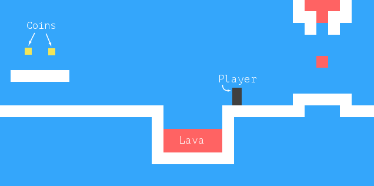

# **Plataform Game**

## **1. Introduction.**

The chapter will work through the impementation of a small plataform game. Plataform games (or "jump" and "run" games) are games that expect the player to move a figure through a world, wich is usually two-dimensional and viewed from the side, while jumping over and onto things.

## **2. The Game. 🔴**

Our game will be roughly based on Dark blue [ website](www.lessmilk.com/games/10)

### 2.1 Scenario.

* The *dark box* represents the `player`
* The *yellow boxes* are the `coins`
* The *red boxes* are the `lava`

### 2.2 Movement.

The player can walk around with the `left` and `right` arrow keys and can jump with the `up arrow`.

## **3. The Technology. 🔴** 

We will use the browser DOM to display the game, and we'll read user input by handling key events

We can represent the background as a table since it is an unchanging grid of squares. The free-moving elements can be overlaid using absolutely positioned elements.

## **4. Levels. 🔴**

We will want a human-readable, human-editable way to specify levels.
Since it is okay for everything to start out on a grid, we could use big string in which each character represents an element- either a part of the background grid or a moving element.

The **plan** for a small level might look like this

~~~javascript
let simpleLevelPlan = `
......................
..#................#..
..#..............=.#..
..#.........o.o....#..
..#.@......#####...#..
..#####............#..
......#++++++++++++#..
......##############..
......................`;
~~~

* `periods(.)` are **empty space**.
* `hash(#)` are **walls**.
* `plus(+)` are **lava**.
* `at(@)` are **player's starting position**.
* `character(o)` are **coins**.
* `equal(=)` are **block of lava that moves back and forth horizontally**.
* `pipe(|)` are **vertically moving lava blobs**.
* `character(v)` are **dripping lava**.

**The level is completed when all coins have been collected. If the player touches lava, the current level is restored to its starting position, and the player may try again.**

## **5. Reading a level. 🔴**

> Block quotes are
> written like so.v
>
> They can span multiple paragraphs,
> if you like.

    # Let me re-iterate ...
    for i in 1 .. 10 { do-something(i) }

~~~
define foobar() {
    print "Welcome to flavor country!";
}
~~~

~~~python
import time
# Quick, count to ten!
for i in range(10):
    # (but not *too* quick)
    time.sleep(0.5)
    print(i)
~~~